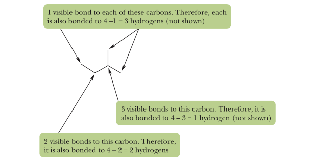
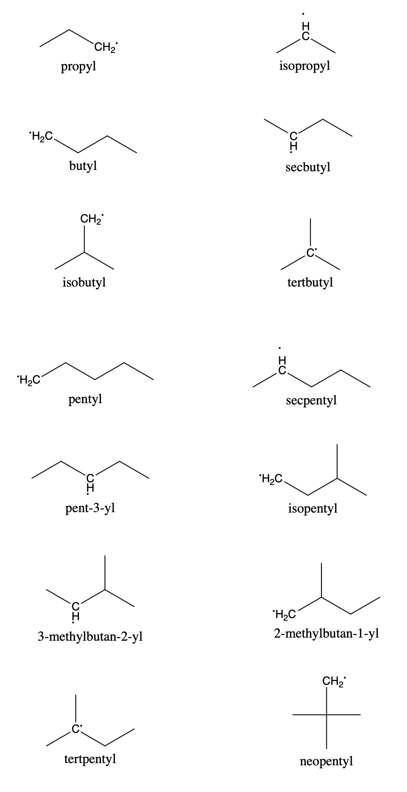
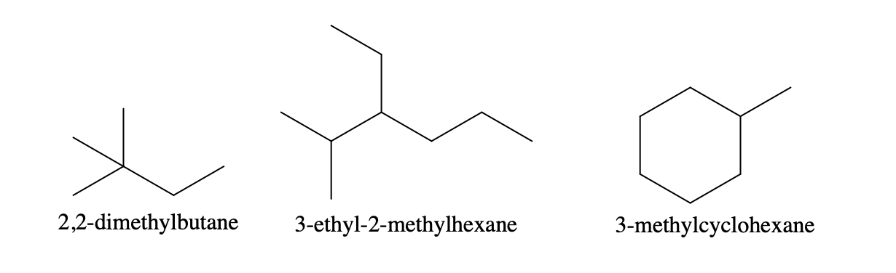
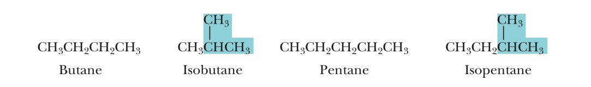

# Chapter 3: Alkanes and Cycloalkanes 烷烃和环烷烃

## 3.0 Hydrocarbons 烃

 **Definition** 只含有C&H

 **Classification**
  - Aliphatic Hydrocarbons 脂肪烃
    - Alkanes 烷烃
    - Alkenes 烯烃
    - Alkynes 炔烃
  - Aromatic Hydrocarbons 芳香烃
    - Benzene 苯
    - ...

## 3.1 What Are Alkanes? 什么是烷烃?


### 1. Formulas

#### Molecular formula
C~2~H~6~, CH~4~, $\cdots$

#### Lewis formula
```
        H
        |
    H H-C-H H   H
    |   |   |   |
H---C---C---C---C---H
    |   |   |   |
    H   H   H   H
```
#### Condensed structural formula
CH~3~(CH~2~)~3~CH~3~

#### Line-angle formula



## 3.2 What Is Constitutional Isomerism in Alkanes? 什么是烷烃的构造异构?
### Classification of Isomers
- Constitutional Isomers 构造异构
  - Skeletal Isomers: 碳链的结构不同
  - Positional Isomers: 官能团的位置不同
  - Functional Isomers: 官能团不同
- Stereo-isomers 立体异构
  - Configurational Isomers 构型异构: 异构体之间不能直接转化
    - Cis-trans Isomers 顺反异构: 由于双键的不可旋转造成的
    - Optical Isomers 旋光异构: 由于手型和不对称性造成的
  - Conformational Isomers 构象异构: 在一定程度下可以转化的, 如staggered conformation和eclipsed conformation

### Physical Properties Of Skeletal Isomers
1. 主链越长, 沸点越高
2. 支链越多, 沸点越低

### 枚举Skeletal异构体
1. 写出线性主链.
   1. 在链中取出1个碳原子作为支链, 尝试排在不同的位置
   2. 在主链中再取出一个碳原子, 尝试排在不同位置.
   $$\cdots\cdots$$
## 3.3 How Do We Name Alkanes? 我们是如何命名烷烃的?
### 1. IUPAC Naming
{位号1, 位号2 $\cdots$ - Prefix(es) + Substitute Group Name - } $\cdots$ + {Prefix(es) + Root + ane}
| Number of Substitute Groups | Prefix |
| :-------------------------: | :----: |
|              1              | (none) |
|              2              |  di-   |
|              3              |  tri-  |
|              4              | tetra- |
|              5              | penta- |
|              6              | hexa-  |
|              7              | hepta- |
|              8              | octa-  |
|              9              | nova-  |
|             10              | deca-  |
---

---

| Number of Carbon |   Root    |
| :--------------: | :-------: |
|        1         |   Meth-   |
|        2         |   Eth-    |
|        3         |   But-    |
|        4         |   Prop-   |
|        5         |   Pent-   |
|        6         |   Hex-    |
|        7         |   Hept-   |
|        8         |   Oct-    |
|        9         |   Non-    |
|        10        |   Dec-    |
|        11        |  Undec-   |
|        12        |  Dodec-   |
|        13        |  Tridec-  |
|        14        | Tetradec- |
|        15        | Pentadec- |
|        16        | Hexadec-  |
|        17        | Heptadec- |
|        18        | Octadec-  |
|        19        | Nonadec-  |
|        20        |  Eicos-   |


**Suffix of Alkanes:** -ane

Steps:
1. 选择碳链最长, 支链位号从小到大排序字典序更小, 且取代基更多的链作为主链, 决定Root; 若是环, 则在前缀中加入cyclo.
2. 选择支链位号从小到大排序字典序最小的方向作为编号方向
3. 按照支链(除了前缀)的首字母顺序决定支链书写的位次, **其中iso-&neo--也要计入**

Examples:



### Common Names

### Primary, Secondary, Tertiary & Quaternary
1. 伯碳, Primary, 1$\degree$ : 碳上连着一个碳原子
2. 仲碳, Secondary, 2$\degree$ : 碳上连着两个碳原子
3. 叔碳, Tertiary, 3$\degree$ : 碳上连着三个碳原子
4. 季碳, Quaternary, 4$\degree$ : 碳上联着四个碳原子  
   伯氢, 仲氢, 叔氢分别是伯碳, 仲碳, 叔碳上连着的氢.