# 有机化学笔记

[toc]

## 酸碱理论

### 酸碱类别

1. Arrhenius acid and Arrhenius base

​    酸：溶于水中产生$H^+$的物质

​    碱：溶于水中产生$OH^-$的物质

2.  Brønsted-Lowry acid and base

   酸：质子给予者

   碱：质子接受者

3. Lewis acid and base

   酸：接受一对电子，而产生共价键的分子或离子

   碱：给出一对电子，而产生共价键的分子或离子

*From top to bottom, the applicability of the acid-base theory is getting wider and wider.*

### 酸碱反应

#### 共轭酸碱

即反应物的对应产物

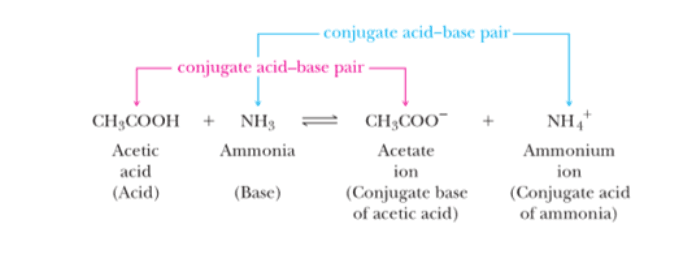

**特点**：酸的酸性越强，它共轭碱的碱性就越弱，反之亦然

#### 反应平衡

强酸，强碱制备弱酸，弱碱

### 酸碱强度

#### 定义

强酸/碱：在溶剂中完全电离

弱酸/碱：在溶剂中不完全电离

#### **$pK_a$**

**使用$pK_a$表示酸性强度**

* $pK_a=-log_{10}K_a$

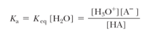

* $pK_a$越大，酸性越弱

* 弱酸的$pK_a$大于等于0（$K_a$小于等于1）

* 强酸的$pK_a$小于0（$K_a$大于1）

#### 酸性强弱判断

1. **电负性（Electronegativity）**

  考虑HA，A的电负性越大，则$A^-$的稳定性越强，HA的酸性越强。

2. **共振效应（Resonance Effect）**

  若一个酸的共轭碱有共振体，则它比较稳定，该酸的酸性强

3. **诱导效应（Inductive Effect）**

  分子吸引电子会使酸性增强：如F

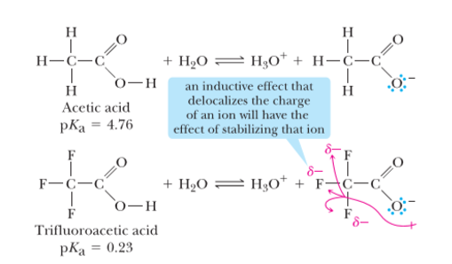

  分子给电子会使酸性减弱：如R基

4. **大小（Size）**

  考虑HX，X越大，HX酸性越大

#### 碱性强弱判断

与酸正好相反

#### 酸碱强度表

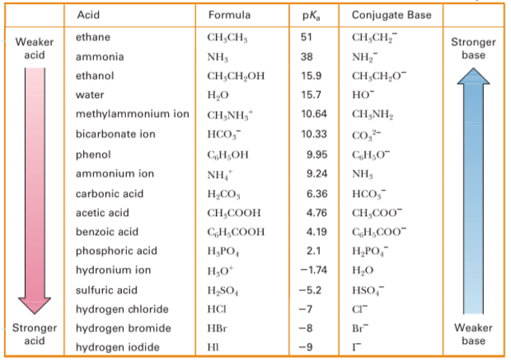

## 卤代烃

## 醇，醚和硫醇

### 醇（Alcohol）

#### 命名

1. 选含羟基的最长碳链为母链

2. 排序时羟基优先

3. 把alkane的*-e*换成*-ol*
4. 环醇，乙醇不加数字
5. 若有两个及以上羟基，在-ol前加-edi或-etri

例子：

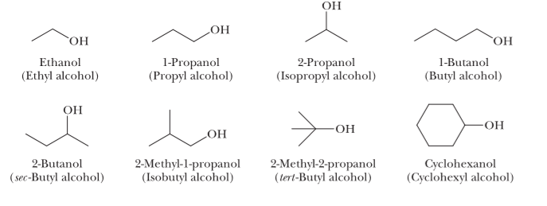

#### 物理性质

1. 极性分子
2. 熔点对于烷烃来说较高（由于氢键的存在）

### 醇的化学反应

#### 酸性

由于*R-*电子云密度大，醇的酸性比水小：（水和甲基酸性反常）

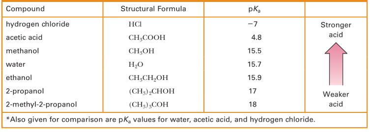

#### 碱性

弱碱性

#### 与金属反应

金属醇盐（metal alkoxide）的命名：

1. 把阳离子名字放前面
2. 保留前缀（*meth-，eth-，isoprop-*……）
3. 加上后缀*-oxide*

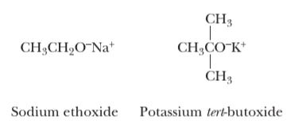

#### 转化成卤化烃

1. 与卤酸反应

2. 转化容易程度（3°>2°>1°）

3. 不同的反应条件

   * 水溶性叔醇（water-soluble tertiary alcohol）室温即可

     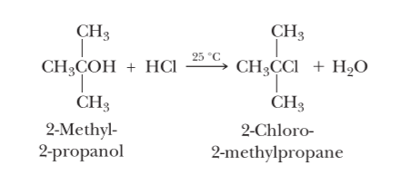

   * 不溶于水的叔醇：diethyl ether 或THF

     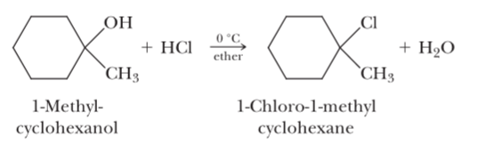

   * 伯醇，仲醇：加热

4. 分子历程

   

   原因：

   * electronic factor： 叔碳正离子最稳定
   * steric factor：叔碳空间位阻大，不易发生$S_N2$反应

5. 需要$H^+$离子产生更好的离去基

   

#### 脱水（dehydration）

1. 条件：强酸，加热

   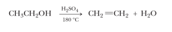

2. 容易程度（3°>2°>1°）

3. 满足Zaitsev's rule：脱去取代基较多碳原子上的氢

   

4. 与烯烃的关系：可相互转化，水多时倾向醇，反之倾向烯烃

5. 需要$H^+$离子产生更好的离去基

   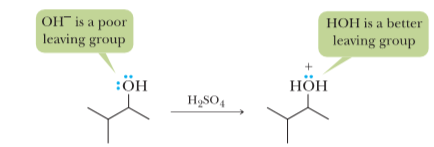

**注意**：若进行E1消除，反应物顺反结构都有

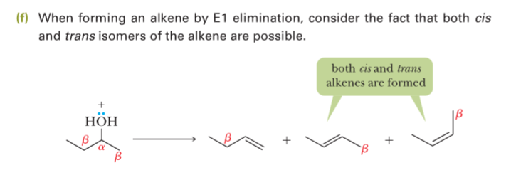

#### 氧化

1. 过程：先反应成醛，再反应成羧酸（或成酮）

   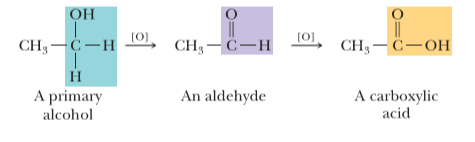

2. 伯醇反应条件：

   与$H_2CrO_4$反应成羧酸

   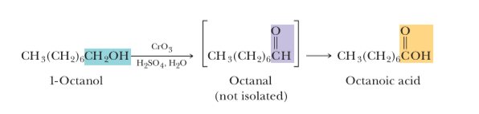

   与PCC反应成醛（不进行下一步）

   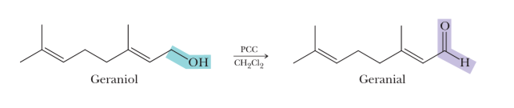

3. 仲醇反应条件：chromic acid and PCC 都可

   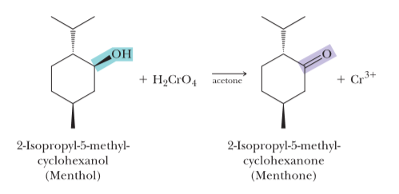

4. 叔醇不能被氧化

