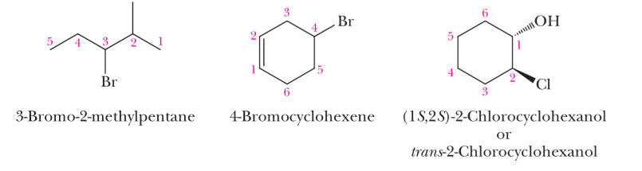

# 有机化学笔记

[toc]

## 酸碱理论

### 酸碱类别

1. Arrhenius acid and Arrhenius base

​    酸：溶于水中产生$H^+$的物质

​    碱：溶于水中产生$OH^-$的物质

2.  Bronsted-Lowry acid and base

   酸：质子给予者

   碱：质子接受者

3. Lewis acid and base

   酸：接受一对电子，而产生共价键的分子或离子

   碱：给出一对电子，而产生共价键的分子或离子

*From top to bottom, the applicability of the acid-base theory is getting wider and wider.*

### 酸碱反应

#### 共轭酸碱

即反应物的对应产物

**特点**：酸的酸性越强，它共轭碱的碱性就越弱，反之亦然

#### 反应平衡

强酸，强碱制备弱酸，弱碱

### 酸碱强度

#### 定义

强酸/碱：在溶剂中完全电离

弱酸/碱：在溶剂中不完全电离

#### **$pK_a$**

**使用$pK_a$表示酸性强度**

* $pK_a=-log_{10}K_a$

* $pK_a$越大，酸性越弱

* 弱酸的$pK_a$大于等于0（$K_a$小于等于1）

* 强酸的$pK_a$小于0（$K_a$大于1）

#### 酸性强弱判断

1. **电负性（Electronegativity）**

  考虑HA，A的电负性越大，则$A^-$的稳定性越强，HA的酸性越强。

2. **共振效应（Resonance Effect）**

  若一个酸的共轭碱有共振体，则它比较稳定，该酸的酸性强

3. **诱导效应（Inductive Effect）**

  分子吸引电子会使酸性增强：如F

  分子给电子会使酸性减弱：如R基

4. **大小（Size）**

  考虑HX，X越大，则$X^-$的稳定性越强，HX酸性越大

#### 碱性强弱判断

与酸正好相反

#### 酸碱强度表

## 手性（chirality）

### 立体异构（ Stereoisomers）

立体异构有相同原子，相同连接顺序，但是三维结构不同

如顺反异构（*cis–trans* isomers ）

#### 异构体思维导图

### 手性碳原子

最常见的手性：**$sp3$杂化的碳原子连接四个不同的基团**，称此碳原子为手性中心（chiral center），它是立构中心（stereocenter）的一种

#### 非手性

非手性（achiral）的物质：能与自己的镜像重合

构成非手性的因素：

* 对称面

  

* 对称中心

  

#### R，S系统

定义：

用于描述立构中心的规则。

工具：

* 优先性规则（priority rules）
* 手性中心碳原子

步骤：

1. 给中心碳原子的四个取代基分配优先级，从1（最高）到4（最低）
2. 在空间中确定分子方向，使第四组远离你
3. 按顺序（1-3）读你面前的三组取代基。
4. 若方向为顺时针，则为R；若为逆时针，则为S。

### 多个手性中心

#### 2^n^规则

有n的手性中心的物质有2^n^种立体异构

#### 对映体与非对映体

**对映体（Enantiomers）**：分子为不可重叠镜像的立体异构体

**非对映体 （Diastereomers）**： 分子不是镜像的立体异构体

各个异构的关系：

例子：

该原子有四个不同的立体异构，如图：

其中（a）,（b）为一组对映体，（c）,（d）为一组对映体

而（a）,（c）为一组非对映体，（b）,（d）为一组非对映体

#### 内消旋化合物（meso compound）

考虑化合物：

有四种立体异构：

然而，**(c),(d)是完全相同的分子**。(c)与其镜像重合，因此(c)是非手性化合物。

由于(c)有手性中心，但不是手性化合物，**我们叫它内消旋化合物。**

因此，准确来说，该化合物有三种立体异构——一对对映体和一个内消旋化合物，内消旋化合物为其他两个分子的**非对映体**。

#### 性质

* 对映体在非手性环境中，有**完全相同的物理化学性质**。
* 非对映体有不同的物理化学性质。
* 对映体对平面偏振光有不同的旋转效果，因此称之是光学活性的。（optically active）

#### 外消旋混合物（Racemic Mixtures ）

* 等摩尔量的一对对映体组成的混合物
* 无光学活性

## 卤代烃（Haloakanes）

### 命名（IUPAC）

1. 从第一次遇到取代基的方向找到母链并编号。

2. 用前缀*fluoro-,chloro-,bromo-, and iodo-,*表示卤素取代基，并将它们与其他取代基按字母顺序排列。

3. 在卤代烯烃中，双键的位置决定了母链的编号。在含有以后缀(如*-ol， -al， -one， -oic acid*)表示的官能团的分子中，后缀所表示的官能团的位置决定了其编号:

   

   

### 亲核取代（Nucleophilic Substitution）

反应过程：

#### 亲核试剂（nuclephile）

1. 如果亲核试剂带负电，产物为中性
2. 如果亲核试剂不带电，产物带正电，通常之后会经历质子的转移

常见的亲核试剂：

### 亲核取代的分子历程

#### 双分子历程（$S_N2$）

两个过程同时发生：

1. 亲核试剂和亲电试剂形成新共价键
2. 旧键的断裂

**注意**：==$S_N2$反应中构象发生反转==

#### 单分子历程（$S_N1$）

两个过程分步进行：

1. 旧键断裂

   

2. 亲核试剂和亲电试剂形成新共价键

   

3. 若亲核试剂原先不带电，产物最后会转移一个质子

   

**注意：**==$S_N1$反应的产物为外消旋混合物==（racemic mixture）

#### 分子历程的决定因素

1. **亲核性（nucleophilicity）**

   亲核性越强，越有可能发生$S_N2$历程

   阴离子比分子的亲核性强

   

2. **卤代烃的结构**

   * 碳正离子越稳定，越有可能发生$S_N1$历程
   * 空间位阻（Steric hindrance）越大，越不可能发生$S_N2$历程

   ==因此，R-基越多，越有可能发生$S_N1$反应==

   

3. **离去基**（The Leaving Group）

   离去基越强，反应越快

   

4. **溶剂（Solvent）**

   * 质子溶剂（protic solvent）是有-OH基团的，可以形成氢键的溶剂。可以溶解$S_N1$生成的阴阳离子，==因此倾向于发生$S_N1$历程==。

     

     ==且质子的溶剂的极性越强，越可能发生$S_N1$历程。==

     

   * 非质子溶剂（Aprotic solvents）没有-OH基团，不可以形成氢键，因此离去基不能被溶解，==不能作为$S_N1$历程的溶剂。==

     

#### 总结

* 亲核性强，非质子溶剂，R-基少的卤代烃==倾向$S_N2$==
* 亲核性弱，质子溶剂，R-基多的卤代烃==倾向$S_N1$==

### $\beta$消除（$\beta$-elimination）

* 在卤代烃中$\beta$消除具体为：脱氢卤化作用（dehydrohalogenation）

* 反应试剂为：**碱**

* 其中$\alpha$碳为连卤素的原子，$\beta$碳为其旁边的碳

#### 扎依采夫规则（Zaitisev's rule）

消除反应的主要产物是最稳定的烯烃；也就是说，主产物是碳碳双键上取代基最多的烯烃。

### 消除反应的分子历程

#### 单分子历程（E1）

分为两步：

1. 断裂旧键

   

2. 碱把质子抢走

   

#### 双分子历程（E2）

两个反应同时发生：

* 断裂旧键
* 碱把质子抢走

#### 分子历程的决定因素

* 伯碳不能进行E1历程
* 碱性越强，越可能进行E2历程

### 消除反应和亲核取代的竞争

由于亲核试剂也呈碱性，消除反应和亲核取代是并存且相互竞争的。

#### $S_N1$和E1历程

* ==叔卤代烃和仲卤代烃在极性质子溶剂中，与弱亲核试剂反应，==发生$S_N1$和E1历程

* 第一步都为断键

  

* 具体发生$S_N1$和E1中的哪个，要以亲核性和碱性相对大小判断

  如，下面两个都是$S_N1$：（碱性太弱）

  

  

#### $S_N2$和E2历程

1. $\alpha-$碳和$\beta-$碳空间位阻的增加有利于E2历程，不利于$S_N2$历程

   原因：大空间位阻会阻碍亲核试剂的进攻，但会增加烯烃的稳定性。

2. 亲核性越强，越可能进行$S_N2$历程，碱性越强，越可能进行E2历程。

#### 总结

1. 伯卤代烃主要进行$S_N2$历程，但在**体积大**的**强碱**进攻下进行E2历程。
2. 仲卤代烃四种历程都有可能进行
   * 强碱进攻，主要进行E2
   * 强亲核性且弱碱性的试剂进攻，主要进行$S_N2$==（如I^-^和CH~3~CH~2~O^-^）==
   * 弱碱弱亲核试剂进攻，进行$S_N1$和E1历程
3. 叔卤代烃在强碱下进行E2历程，弱碱下进行$S_N1$和E1历程

**补充：（书上没有）**

1. 高温倾向消除反应
2. 溶剂极性越强，越可能进行亲核取代
3. 具体主要是$S_N1$还是E1历程，要以亲核性和碱性相对大小判断

#### 判断步骤

1. 先看试剂碱性、亲核性强弱，决定单、双分子历程
2. 再看取代基数目，决定是消除反应还是亲核取代
3. 若还不能确定，再看其他：
   * 溶剂类型
   * 溶剂极性
   * 温度
   * 亲核性和碱性相对大小

## 醇，醚和硫醇

### 醇（Alcohol）

#### 命名

1. 选含羟基的最长碳链为母链

2. 排序时羟基优先

3. 把alkane的*-e*换成*-ol*
4. 环醇，乙醇不加数字
5. 若有两个及以上羟基，在-ol前加-edi或-etri

例子：

#### 物理性质

1. 极性分子
2. 熔点对于烷烃来说较高（由于氢键的存在）

### 醇的化学性质

#### 酸碱性

由于*R-*电子云密度大，醇的酸性比水小：（水和甲基酸性反常）

醇呈弱碱性

#### 与金属反应

金属醇盐（metal alkoxide）的命名：

1. 把阳离子名字放前面
2. 保留前缀（*meth-，eth-，isoprop-*……）
3. 加上后缀*-oxide*

#### 转化成卤化烃

1. 与卤酸反应

2. 转化容易程度（3°>2°>1°）

3. 不同的反应条件

   * 水溶性叔醇（water-soluble tertiary alcohol）室温即可

     

   * 不溶于水的叔醇：乙醚（diethyl ether） 或THF

     

   * 伯醇，仲醇：加热

4. 分子历程

   

   原因：

   * Electronic factor： 叔碳正离子最稳定
   * Steric factor：叔碳空间位阻大，不易发生$S_N2$反应

5. 需要$H^+$离子产生更好的离去基

   

#### 脱水（dehydration）

1. 条件：强酸，加热

   

2. 容易程度（3°>2°>1°）

3. 满足Zaitsev's rule：脱去取代基较多碳原子上的氢

   

4. 与烯烃的关系：可相互转化，水多时倾向醇，反之倾向烯烃

5. 需要$H^+$离子产生更好的离去基

   

**注意**：若进行E1消除，反应物顺反结构都有

#### 氧化

1. 过程：先反应成醛，再反应成羧酸（或直接成酮）

   

2. 伯醇反应条件：

   与$H_2CrO_4$反应成羧酸

   

   与PCC反应成醛（不进行下一步）

   

3. 仲醇反应条件：$H_2CrO_4$或 PCC 都可以

   

4. 叔醇不能被氧化

